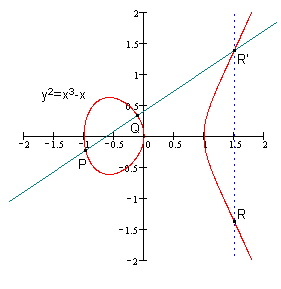
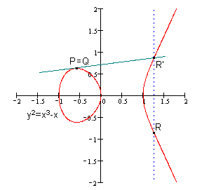
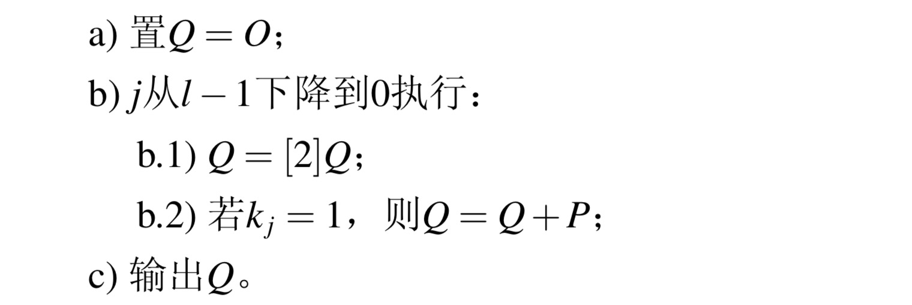
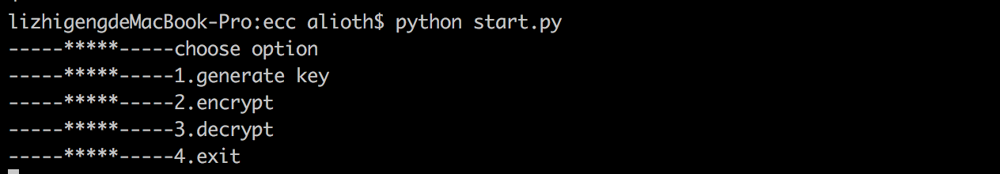
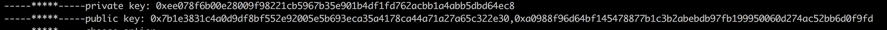
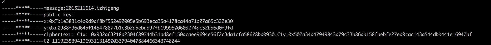
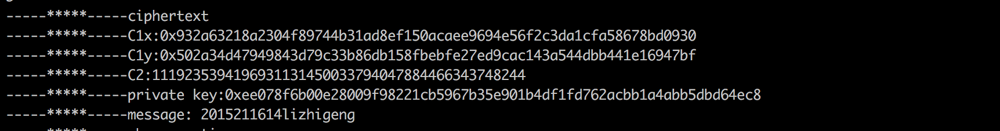

#ECC椭圆曲线加密算法

##算法流程

>选定一条椭圆曲线Ep(a,b)，并取椭圆曲线上一点作为基点G
>生成私钥和公钥
>使用公钥对明文进行加密
>使用私钥对密文进行解密

###椭圆曲线参数的生成
>generateParameters.py

椭圆曲线的形式为
$$
y^2=x^3+ax+b
$$
a,b的生成函数
```python
def generateAB(p):
    seed = random.randint(0x000000000000000000000000, 0xffffffffffffffffffffffff)
    seed = hex(seed)
    H = hashlib.sha256(seed.encode('UTF-8')).hexdigest()
    b = int(H, 16) % p
    a = random.randint(0, p)
    tmp = 4 * (a ** 2) + 27 * (b ** 3)
    if tmp % p == 0:
        seed, a, b = generateAB(p)
    return seed, a, b
    
```
基点G的选择
随机生成横坐标Gx，通过曲线方程解得Gy
$$
y^2\equiv \ g (mod p)
$$
函数``` modPower(p, g)``` 是模素数平方根的求解函数，分成三种情况求得平方根，其中**Exponentiation()**为有限域Ep中的指数运算。由于存在二次同余的情况，在求不出Gy的情况下需要对Gx进行重新的选取。

```python
def modPower(p, g):
    if (p - 3) % 4 == 0:
        j = (p - 3) % 4
        u_1 = (p - 3) // 4
        y = Exponentiation(u_1 + 1, g, p)
        z = Exponentiation(2, y, p)
        if z == g:
            return y
        return False
    elif (p - 5) % 8 == 0:
        u_2 = (p - 5) // 8
        z = Exponentiation(2 * u_2 + 1, g, p)
        if (z - 1) % p == 0:
            y = Exponentiation(u_2 + 1, g, p)
            return y
        elif (z + 1) % p == 0:
            y = (2 * g * Exponentiation(u_2, 4 * g, p))
            return y
        return False
    elif (p - 1) % 8 == 0:
        u_3 = (p - 1) // 8
        Y = g
        X = random.randint(0, p)
        U, V = lucas(p, X, Y, 4 * u_3 + 1)
        if ((V ** 2) - 4 * Y) % p == 0:
            return (V / 2) % p
        if U % p != 1 and U % p != p - 1:
            return False
```
函数```generateG(p, a, b)```为基点G的生成函数，返回值为基点的坐标
```python
def generateG(p, a, b):
    x = random.randint(0, p)
    tmp = x ** 3 + a * x + b
    if tmp % p == 0:
        return x, 0
    g = tmp % p
    y = modPower(p, g) % p
    if y == False:
        x, y = generateG(p, a, b)
    return x, y
    
```
>由于p的选取太大运算时间会很长，所以选取一个较小素数p并进行了验证，验证部分代码和结果如下

```python
	p = 10000141
    seed, a, b = generateAB(p)
    Gx, Gy = generateG(p, a, b)
    print(a)
    print(b)
    print(Gx)
    print(Gy)
    result = Gx ** 3 + a * Gx + b
    print(result % p)
    print(Gy ** 2 % p)
```

result

```
4334259
8520997
2035797
4690585
7424318
7424318

Process finished with exit code 0
```

###椭圆曲线上的运算法则

> 椭圆曲线的公式为$$y^2=x^3+ax+b$$

定义零点的坐标为(0,0)

两个不同点$$P(x_1,y_1)、Q(x_2,y_2)$$的加法



$$R(x_3,y_3)=P+Q$$ 。通过计算斜率，只限于椭圆曲线的交点。P，Q，R三点的坐标和直线PQ的斜率具有如下关系
$$
k=(y_2-y_1)/(x_2-x_1)
$$

$$
x_3\equiv k^2-x_1-x_2(modp)
$$

$$
y_3\equiv k(x_1-x_3)-y_1(modp)
$$


若P、Q重合



此时直线的斜率为
$$
k=(3x^2+a)/2y
$$
P、Q、R三点的坐标关系同上

椭圆曲线上两点相加的代码实现，其中**modInverse()**为根据费马定理实现的求逆元算法

```python
def sameplus(x1, y1, a, p):       # 相同点相加
    if x1 == 0 and y1 == 0:
        return 0, 0
    k = ((3 * x1 * x1 + a) * reverse.modInverse(2 * y1, p)) % p
    x = (k ** 2 - 2 * x1) % p
    y = (k * (x1 - x) - y1) % p
    return x, y


def diffplus(x1, y1, x2, y2, a, p):						#不同点相加
    if x1 == 0 and y1 == 0:
        return x2, y2
    elif x2 == 0 and y2 == 0:
        return x1, y1
    else:
        k = ((y2 - y1) * reverse.modInverse(x2 - x1, p)) % p
        x = (k ** 2 - x1 - x2) % p
        y = (k * (x1 - x) - y1) % p
        return x, y

```

```python
def modInverse(x, p):
    ret = 1
    exponent = p - 2
    while exponent != 0:
        if exponent & 1 == 1:
            ret = ret * x % p
        exponent = exponent >> 1
        x = x * x % p
    return ret
```

加法主要是为了计算多倍点。

私钥的生成：随意生成一个大于零小于椭圆曲线阶的数

```python
def gensk(n):
    secretkey = random.randint(0, n)
    return hex(secretkey)
```

公钥的生成：K=kG，需要用到多倍点计算

计算多倍点时，采用了二进制展开的方法，算法流程如下



多倍点计算的代码如下，返回值就是公钥

```python
def multiplication(sk, Gx, Gy, a, p):
    Q = [0, 0]
    k = bin(sk)[2:][::-1]
    for j in range(len(bin(sk)[2:]) - 1, -1, -1):
        Q[0], Q[1] = sameplus(Q[0], Q[1], a, p)
        if k[j] == '1':
            Q[0], Q[1] = plus(Q[0], Q[1], Gx, Gy, a, p)
    return hex(Q[0]), hex(Q[1])
```

### 加密流程

上网查找资料之后发现普遍加密算法为将明文编码到椭圆曲线上再进行多倍点运算，没有给出明确的编码算法，但是在实现编码的过程中，通过x求得y时，可能会存在二次同余的情况，找不到横坐标y。

所以在和同学讨论后，选择了另一种较为简单的加密方式

1.生成随机数r

2.点C1=rG

3.点C2=rP	(P为公钥)

4.将消息转码为整数形式m‘

5.取C2的hash值并和m’做亦或得到值C2‘

6.密文为点C1，C2‘

代码如下

```python
def encrypt(m, Pa, Pb, Gx, Gy, a, p, n):
    x = int(Pa, 16)
    y = int(Pb, 16)
    r = random.randint(0, n)
    Cx1, Cy1 = multiplication(r, Gx, Gy, a, p)
    Cx2, Cy2 = multiplication(r, x, y, a, p)
    m_16 = binascii.b2a_hex(m.encode('UTF-8'))
    m_2 = int(m_16, 16)
    C2 = m_2 ^ hash(Cx2 + Cy2)
    return [Cx1, Cy1], C2
```

### 解密流程

因为C2=rP，P=kG，根据阿贝尔群的交换律，C2=rkG=krG=kC1

1.求的点T=kC1

2.T的hash和C2的hash值相同，将hash(T)与密文C2‘做亦或

3.亦或得到的结果再进行解码，得到明文m

代码如下

```python
def decrypt(sk, C1, C2, Gx, Gy, a, p):
    x = int(C1[0], 16)
    y = int(C1[1], 16)
    x, y = multiplication(sk, x, y, a, p)
    m_10 = C2 ^ hash(x + y)
    m_16 = hex(m_10)
    # print(m_16)
    m = binascii.a2b_hex(m_16[2:])
    return m.decode('ascii')
```


### 运行及结果

由于椭圆曲线参数生成的速度较慢，所以当前椭圆曲线参数是sm2中的推荐参数。如果更换参数直接修改start.py中的各个参数即可。

在python3环境下运行start.py



> Option 1



> Option 2



> Option 3

